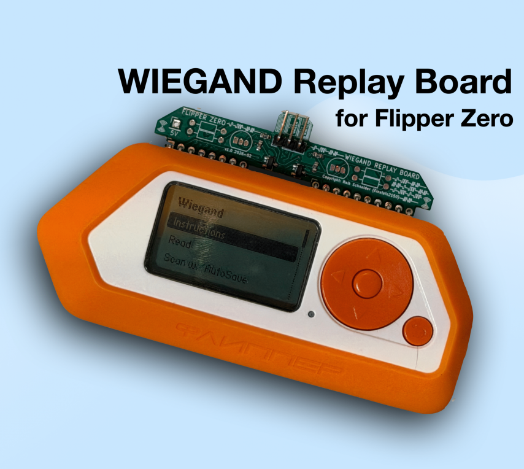
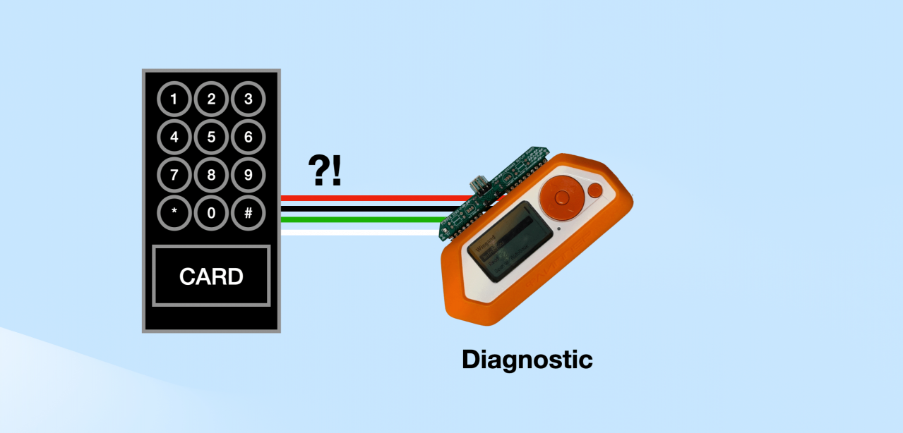
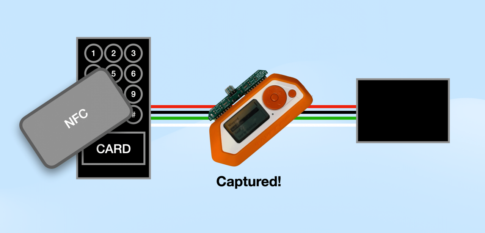
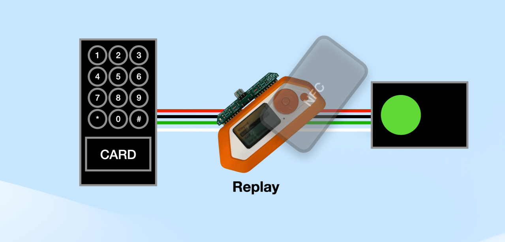
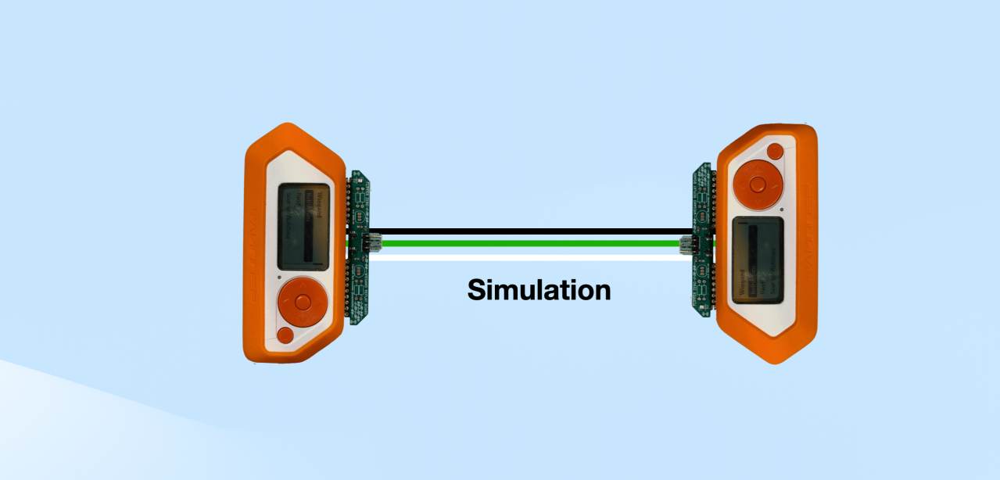
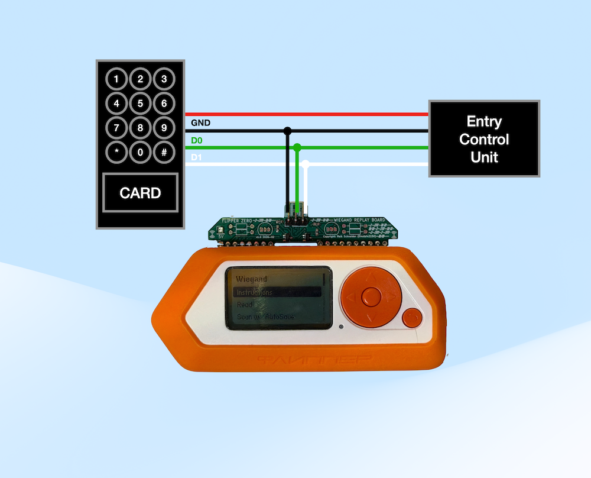

# WIEGAND Replay Board for Flipper Zero
by Raik Schneider (Einstein2150)

**WIEGAND Replay Board for Flipper Zero made with ❤️ in Germany - in cooperation with  [multi-circuit-boards.eu]( https://www.multi-circuit-boards.eu)**

WIEGAND Replay Board Application (fap): [https://github.com/Einstein2150/WIEGAND-Replay-Board-for-Flipper-Zero/releases](https://github.com/Einstein2150/WIEGAND-Replay-Board-for-Flipper-Zero/releases)

## Buy the WIEGAND Replay Board for Flipper Zero

[Store link](http://flipper.foto-video-it.de)
 
## Features

### General
- This application supports W4, W8, W24, W26, W32, W34, W37, W40 and W48 formats.
- This application can be used to test Wiegand readers and keypads. It can save the data to a file, and can load and replay the data. Timings are measured and displayed; which can be used to help debug Wiegand readers.

### Read
- Logs raw Wiegand data
- Supports Wiegand‑based systems such as RFID, NFC, PIN pads, magnetic stripe readers, and barcode scanners

### Read with Autosave
- Logs raw Wiegand data in batch mode
- Automatically saves every captured dataset as an individual file on the Flipper Zero
- Optimized for high‑speed data patterns such as PIN codes to ensure no data is lost

### Write
- Replays stored datasets back onto the Wiegand interface
- MOSFETs ensure safe and reliable modulation of data onto the line

### Stand‑Alone / Simulation Mode
- The board drives the data lines to a hardware‑controlled high level, allowing the simulation of an active Wiegand device without real peripherals (e.g., NFC readers)
- Two boards can be linked using optional jumper wires to send and receive Wiegand data between them
- One board can also be paired with the optional ESP‑RFID‑Tool v2 PRO for bidirectional communication
- Optional 5V output pin on the board can power devices such as the ESP‑RFID‑Tool v2 PRO directly

## Installation

Copy the fap-File from [https://github.com/Einstein2150/WIEGAND-Replay-Board-for-Flipper-Zero/releases](https://github.com/Einstein2150/WIEGAND-Replay-Board-for-Flipper-Zero/releases) into the folder "SD Card/apps/GPIO/" of your Flipper Zero.

## Wiring

The Wiegand Replay Board simplifies the wiring dramatically.
All required pull‑ups, MOSFET switching and line‑level handling are already integrated on the PCB.

### Using the Wiegand Replay Board
Only three connections are required:

- D0 (Board) to D0 (Wiegand-Device) - GREEN wire
- D1 (Board) to D1 (Wiegand-Device) - WHITE wire
- GND (Board) to GND (Wiegand-Device) - BLACK wire

That’s it — no resistors, no MOSFETs, no additional components.
The board internally pulls both data lines to 5 V (HIGH).
This allows:

- Safe and clean signal modulation
- Full compatibility with Wiegand readers and controllers
- Stand‑alone operation without any real card reader connected
(the board can simulate an active Wiegand device by itself)
This makes the setup extremely reliable and beginner‑friendly.

### Optional: [ESP‑RFID‑Tool v2 PRO](https://rfid-tool.foto-video-it.de) 
The board includes an optional 5 V output pin, allowing you to directly power the
[ESP‑RFID‑Tool v2 PRO](https://rfid-tool.foto-video-it.de) without an external power supply.
Both devices can exchange Wiegand data bidirectionally when connected.

### Jumper on the Wiegand Replay Board
There are 3 Jumpers on the backside of the board:

- Jumper 1 (J1): cut to disable 5V-Support
- Jumper 2 (J2): cut to disable high-level on pin d1
- Jumper 3 (J3): cut to disable high-level on pin d0

 
## Wiegand Deep-Dive (Informational)

### W4: 4-bit Wiegand

This format is used by some keypads. Digits 0-9 are sent as 0-9. ESC is sent as 10 and ENTER as 11. There is no parity bit. The application will display
the button pressed (including ESC and ENTER).

### W8: 8-bit Wiegand

This format is used by some keypads. The last 4 bits are the actual data.Digits 0-9 are sent as 0-9. ESC is sent as 10 and ENTER as 11. The first 4 bits are the inverse of the last 4 bits. The application will display
the button pressed (including ESC and ENTER). If there are any bit errors, the application will show the incorrect bits.

### W26: 26-bit Wiegand

This is a 26-bit format used by many readers. The first bit is an even parity bit. The next 8 bits are the facility code. The next 16 bits are the card number. The last bit is an odd parity bit. The application will display the facility code and card number. If there are any bit errors, the application will show the incorrect bits (the even partity is the first 13 bits, odd parity is the last 13 bits).

### W24: 24-bit Wiegand

This is similar to W26, but without the leading and trailing parity bits. The first 8 bits are the facility code. The next 16 bits are the card number. The application will display the facility code and card number.

### W35: 35-bit Wiegand

This is HID 35 bit Corporate 1000 - C1k35s format. The first bit is odd parity 2 (based on bits 2-35). The next bit is even parity (based on 4-5,7-8,10-11,...,33-34). Then 12 bit company code. Then 20 bit card id. Then odd parity 1.

### W36: 36-bit Wiegand

This is decode HID 36 bit Keyscan - C15001 format. The first bit is an even parity bit. The next 10 bits are the OEM number. The next 8 bits are the facility code. The next 16 bits are the card number. The last bit is an odd parity bit.
Other 36 bit credentials may be decoded incorrectly.

### W48: 48-bit Wiegand

This is HID 48 bit Corporate 1000 - C1k48s format. The first bit is odd parity 2 (based on bits 2-48). The next bit is even parity (based on 4-5,7-8,10-11,...,46-47). Then 22 bit company code. Then 23 bit card id. Then odd parity 1 (based on 3-4,6-7,9-10,...,45-46).

### W32/W34/W37/W40: 32/34/37/40-bit Wiegand

These formats are not very standardized, so the application will not try to interpret the data.

